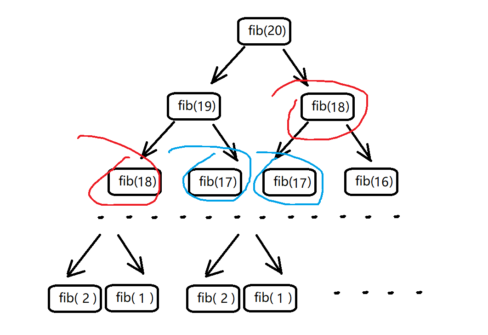
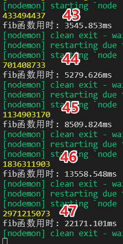
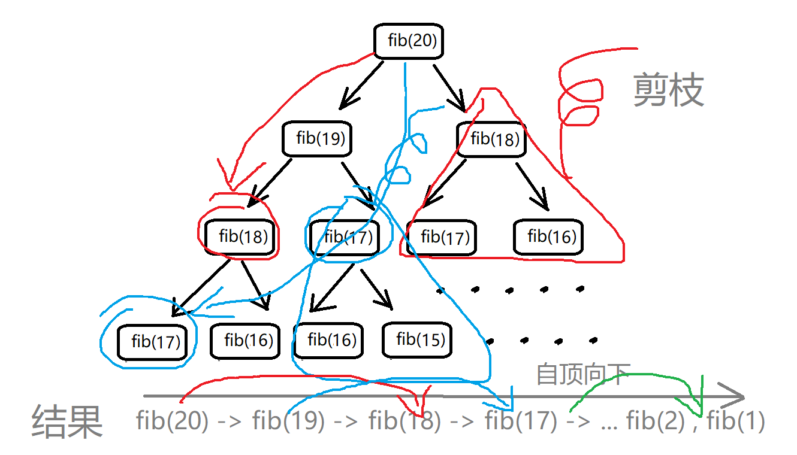
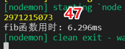
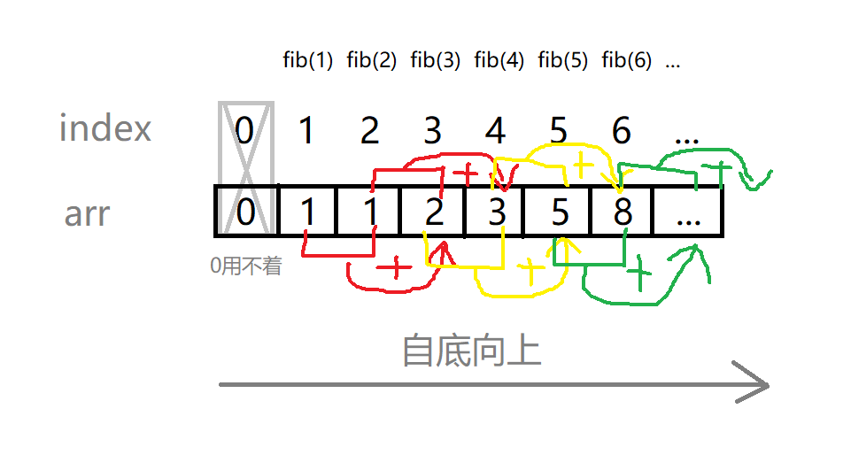
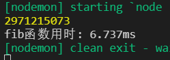

# 斐波那契数列

**斐波那契数列：1, 1, 2, 3, 5, 8, 13, 21, 34, 55, 89, 144, ...**

> 如果设`F(n）`为该数列的第 n 项`（n∈N*）`
>
> 那么这句话可以写成如下形式：**F(n)=F(n-1)+F(n-2)**

设计一个函数，调用该函数传入 n，可以计算 **斐波那契数列** `第n项` 的数字

## 原始递归版

```js
function fib(n) {
  if (n == 1 || n == 2) return 1
  return fib(n - 1) + fib(n - 2)
}
```

> 递归树



> 例 n=20 时，红色圈出的 fib(18)被计算了 2 次，以 fib(18)为根的递归树体量巨大，消耗巨量时间。
>
> 且不止一个类似 fib(18)被重复计算。
>
> 原始递归版效率极低。 

可以通过下图看出，红色是调用 fib 函数传入的 n 值

当 n 值为 46 时，需要的总时间已经突破`10s`

当 n 值为 47 时，需要的总时间已经需要`29s`！

计算时间呈指数级爆炸！

**时间复杂度为 O(2^n)**



## 字典递归版

```js
var fibHelper = {}
function fib(n) {
  if (n == 1 || n == 2) return 1
  if (fibHelper[n]) return fibHelper[n]
  fibHelper[n] = fib(n - 1) + fib(n - 2)
  return fibHelper[n]
}
```

> 递归树



> 递归树剪枝：把已经计算过的 n 值存到字典中，需要用时直接查字典
>
> 所有的 n 值计算 1 次就行了，极大减少了子节点重复计算的问题
>
> 计算方向是自顶向下的

直接计算 `n = 47`，需要的总时间仅需`6.29ms`，同`原始递归版`比较不是一个**数量级**

**时间复杂度是 O(n)**



## 动态规划版

```js
function fib(n) {
  var arr = [0]
  arr[1] = arr[2] = 1
  for (let i = 3; i <= n; i++) {
    arr[i] = arr[i - 1] + arr[i - 2]
  }
  return arr[n]
}
```

> 图解



> 通项公式：f(n) = f(n-1) + f(n-2)
>
> f(n) 看做时状态 n，这个状态 n 是 状态 n-1 和 状态 n-2 相加转移而来，就是状态转移

同样计算`n = 47`，**动态规划版** 和 **字典递归版** 在耗时上几乎没有差别



## 动态规划优化版

> 当前状态只和之前的两个状态有关，其实并不需要 数组 arr 来存储所有的状态，只要想办法存储之前的两个状态就行了。所以，可以进一步优化：

 优化后,**空间复杂度降为 O(1)**

```js
function fib(n) {
  if (n < 2) return n
  let [prev, curr] = [1, 1]
  for (let i = 1; i < n - 1; i++) {
    let sum = prev + curr;
    [prev, curr] = [curr, sum]
  }
  return curr
}
```
