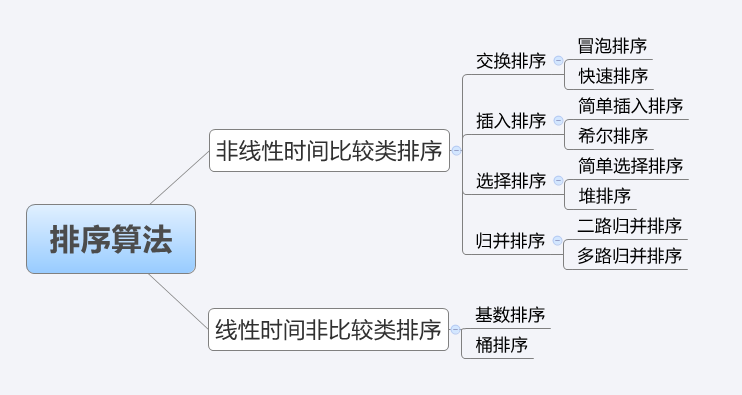

# 十大经典排序算法

## 算法概述

### 1. 算法分类

十种常见排序算法可以分为两大类：

- 比较类排序：通过比较来决定元素间的相对次序，由于其时间复杂度不能突破 O(nlogn)，因此也称为非线性时间比较类排序。
- 非比较类排序：不通过比较来决定元素间的相对次序，它可以突破基于比较排序的时间下界，以线性时间运行，因此也称为线性时间非比较类排序。



### 2. 算法复杂度


### 3. 相关概念

- **稳定**：如果 a 原本在 b 前面，而 a=b，排序之后 a 仍然在 b 的前面。
- **不稳定**：如果 a 原本在 b 的前面，而 a=b，排序之后 a 可能会出现在 b 的后面。
- **时间复杂度**：对排序数据的总的操作次数。反映当 n 变化时，操作次数呈现什么规律。
- **空间复杂度**：是指算法在计算机内执行时所需存储空间的度量，它也是数据规模 n 的函数。

## 排序算法

### 1. 冒泡排序（Bubble Sort）

> 冒泡排序是一种简单的排序算法。
>
> 它重复地走访过要排序的数列，一次比较两个元素，如果它们的顺序错误就把它们交换过来。
>
> 走访数列的工作是重复地进行直到没有再需要交换，也就是说该数列已经排序完成。
>
> 这个算法的名字由来是因为越小的元素会经由交换慢慢“浮”到数列的顶端。

1. 算法描述

   - 比较相邻的元素。如果第一个比第二个大，就交换它们两个；
   - 对每一对相邻元素作同样的工作，从开始第一对到结尾的最后一对，这样在最后的元素应该会是最大的数；
   - 针对所有的元素重复以上的步骤，除了最后一个；
   - 重复步骤 1~3，直到排序完成。

2. 动图演示

   

3. 代码实现

   ```javascript
   function bubbleSort(arr) {
     var len = arr.length
     for (var i = 0; i < len; i++) {
       for (var j = 0; j < len - 1 - i; j++) {
         if (arr[j] > arr[j + 1]) {
           // 相邻元素两两对比
           var temp = arr[j + 1] // 元素交换
           arr[j + 1] = arr[j]
           arr[j] = temp
         }
       }
     }
     return arr
   }
   ```

### 2. 选择排序（Selection Sort）

> 选择排序(Selection-sort)是一种简单直观的排序算法。
>
> 它的工作原理：
>
> 首先在未排序序列中找到最小（大）元素，存放到排序序列的起始位置
>
> 然后，再从剩余未排序元素中继续寻找最小（大）元素，然后放到已排序序列的末尾。
>
> 以此类推，直到所有元素均排序完毕。

1. 算法描述（n 个记录的直接选择排序可经过 n-1 趟直接选择排序得到有序结果。具体算法描述如下：）

   - 初始状态：无序区为 R[1..n]，有序区为空；
   - 第 i 趟排序(i=1,2,3…n-1)开始时，当前有序区和无序区分别为 R[1..i-1]和 R(i..n）。该趟排序从当前无序区中-选出关键字最小的记录 R[k]，将它与无序区的第 1 个记录 R 交换，使 R[1..i]和 R[i+1..n)分别变为记录个数增加 1 个的新有序区和记录个数减少 1 个的新无序区；
   - n-1 趟结束，数组有序化了。

2. 动图演示

3. 代码实现

   ```javascript
   function selectionSort(arr) {
     var len = arr.length
     for (var i = 0; i < len - 1; i++) {
       for (var j = i + 1; j < len; j++) {
         if (arr[i] > arr[j]) {
           // 寻找最小的数
           var temp = arr[j] // 元素交换
           arr[j] = arr[i]
           arr[i] = temp
         }
       }
     }
     return arr
   }
   ```

4. 算法分析

   表现最稳定的排序算法之一，因为无论什么数据进去都是 $O(n^2)​$ 的时间复杂度，所以用到它的时候，数据规模越小越好。唯一的好处可能就是不占用额外的内存空间了吧。理论上讲，选择排序可能也是平时排序一般人想到的最多的排序方法了吧。

### 3. 插入排序（Insertion Sort）

> 插入排序（Insertion-Sort）的算法描述是一种简单直观的排序算法。
>
> 它的工作原理是通过构建有序序列，对于未排序数据，在已排序序列中从后向前扫描，找到相应位置并插入。

1. 算法描述

   一般来说，插入排序都采用 in-place 在数组上实现。具体算法描述如下：

   - 从第一个元素开始，该元素可以认为已经被排序；
   - 取出下一个元素，在已经排序的元素序列中从后向前扫描；
   - 如果该元素（已排序）大于新元素，将该元素移到下一位置；
   - 重复步骤 3，直到找到已排序的元素小于或者等于新元素的位置；
   - 将新元素插入到该位置后；
   - 重复步骤 2~5。

2. 动图演示

3. 代码实现

   ```javascript
   function insertionSort(arr) {
     for (var i = 1; i < arr.length; i++) {
       current = i
       for (var j = i - 1; j >= 0; j--) {
         if (arr[current] < arr[j]) {
           var temp = arr[current] //  交换
           arr[current] = arr[j]
           arr[j] = temp
           current = j
         } else {
           break
         }
       }
     }
   }
   ```

4) 算法分析

   入排序在实现上，通常采用 in-place 排序（即只需用到 O(1)的额外空间的排序），因而在从后向前扫描过程中，需要反复把已排序元素逐步向后挪位，为最新元素提供插入空间。

### 4. 希尔排序（Shell Sort）

> 1959 年 Shell 发明，第一个突破 O(n2)的排序算法，是简单插入排序的改进版。它与插入排序的不同之处在于，它会优先比较距离较远的元素。希尔排序又叫**缩小增量排序**。

1. 算法描述

2. 动图演示

3. 代码实现

   ```javascript
   function sortArr(arr) {
     var len = arr.length
     for (
       var fraction = Math.floor(len / 2);
       fraction > 0;
       fraction = Math.floor(fraction / 2)
     ) {
       for (var i = fraction; i < len; i++) {
         for (
           var j = i - fraction;
           j >= 0 && arr[j] > arr[fraction + j];
           j -= fraction
         ) {
           var temp = arr[j]
           arr[j] = arr[fraction + j]
           arr[fraction + j] = temp
         }
       }
     }
   }
   ```

4) 算法分析

### 5. 归并排序（Merge Sort）

> 插入排序（Insertion-Sort）的算法描述是一种简单直观的排序算法。
>
> 它的工作原理是通过构建有序序列，对于未排序数据，在已排序序列中从后向前扫描，找到相应位置并插入。

1. 算法描述
2. 动图演示
3. 代码实现
4. 算法分析

### 6. 快速排序（Quick Sort）

> 插入排序（Insertion-Sort）的算法描述是一种简单直观的排序算法。
>
> 它的工作原理是通过构建有序序列，对于未排序数据，在已排序序列中从后向前扫描，找到相应位置并插入。

1. 算法描述
2. 动图演示
3. 代码实现
4. 算法分析

### 7. 堆排序（Heap Sort）

> 插入排序（Insertion-Sort）的算法描述是一种简单直观的排序算法。
>
> 它的工作原理是通过构建有序序列，对于未排序数据，在已排序序列中从后向前扫描，找到相应位置并插入。

1. 算法描述
2. 动图演示
3. 代码实现
4. 算法分析

### 8. 计数排序（Counting Sort）

> 插入排序（Insertion-Sort）的算法描述是一种简单直观的排序算法。
>
> 它的工作原理是通过构建有序序列，对于未排序数据，在已排序序列中从后向前扫描，找到相应位置并插入。

1. 算法描述
2. 动图演示
3. 代码实现
4. 算法分析

### 9. 桶排序（Bucket Sort）

> 插入排序（Insertion-Sort）的算法描述是一种简单直观的排序算法。
>
> 它的工作原理是通过构建有序序列，对于未排序数据，在已排序序列中从后向前扫描，找到相应位置并插入。

1. 算法描述
2. 动图演示
3. 代码实现
4. 算法分析

### 10. 基数排序（Radix Sort）

> 插入排序（Insertion-Sort）的算法描述是一种简单直观的排序算法。
>
> 它的工作原理是通过构建有序序列，对于未排序数据，在已排序序列中从后向前扫描，找到相应位置并插入。

1. 算法描述
2. 动图演示
3. 代码实现
4. 算法分析
